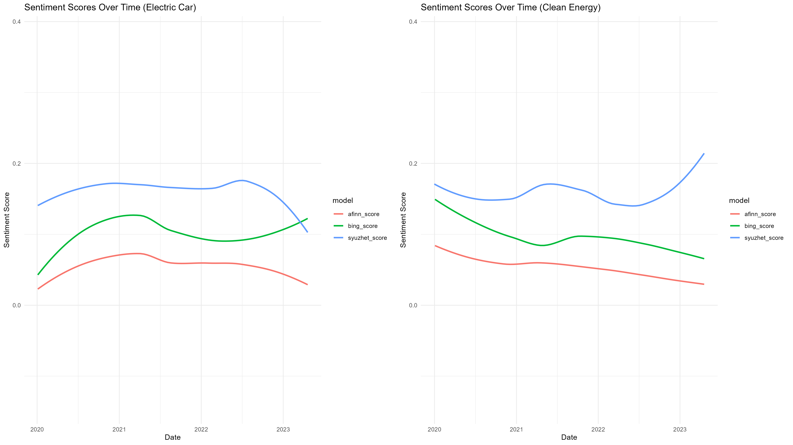

# Data_Mining_EX2
Class EX 2 with Miguel, Patrick, Tobias

This GitHub repository contains a class exercise (CE2) that involves using real-life scraping scenarios with 'The Guardian' API, which provides access to over 2 million articles.

## Research Question

Our goal is to answer the following research question: Can a keyword relationship be found between articles that mention "clean energy" and "electric cars"?

## Hypothesis

We believe that, as climate change becomes an increasingly important issue in our society, renewable energy is gaining more attention. We assume that the car industry is also addressing this issue, as it has an impact on both production and marketing of electric cars. Therefore, we hypothesize that there is a high overlap of keywords between articles that mention "clean energy" and "electric cars".

## Methods

In this repository, you will find our code for scraping articles using the pre-made wrapper function 'gu_content' from the 'guardianapi' package. We also attempted to write a custom-made wrapper function, but the results were unsatisfactory.

We first evaluate the scraped articles using an individual keyword search to get an overview of whether similar keywords are used. You can find our code for this analysis in the repository. We then apply a keyword network analysis to see how articles on the same topic are connected. Our code for this analysis is also available in the repository.

To identify the sentiment of the writers, we also apply a sentiment analysis using the Bing, Afinn, and Syuzhet lexicons. These lexicons provide polarity values that sort words into positive or negative positions with numerical values. We scaled every result so that the range is between -1 and +1. Our code for this analysis can be found in the repository.

## Results

In this repository, you will find our results for each of the analyses performed.

### Keyword Search

Our results show that the expression "prime minister" was used most frequently in both topics, followed by "climate change". There are many other frequently used combinations in both topics.

### Keyword Network Analysis

Our results show that the network for the topic of "electric car" is scattered. The same is true for the topic of "renewable energies", but with individual smaller networks visible within.

## Sentiment Analysis
In *04_sentiment_analysis* we calculate sentiment scores for text data using three different methods: AFINN, Syuzhet, and Bing. The calculated scores are added to the original data frame as new columns and visualized in a plot. This code provides an example of how different sentiment analysis methods can be applied to a dataset of text data to calculate sentiment scores and visualize them.  

Our results show that sentiment remains fairly neutral over time for both topics. Only the Syuzhet analysis shows some changes: from mid-2022 onwards, there is a drop in sentiment for articles on "electric car" / "electric vehicle" and an increase in sentiment for "clean energy" / "renewable energy".