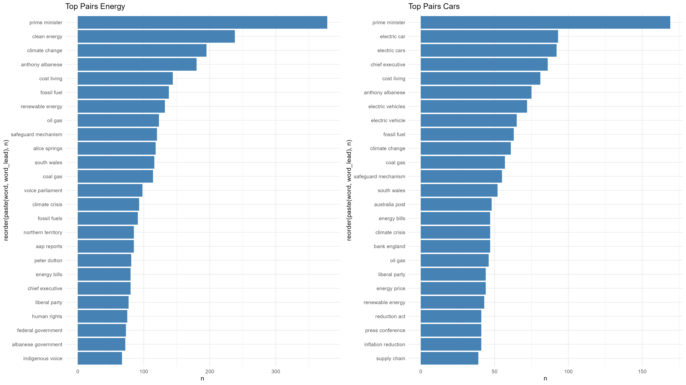
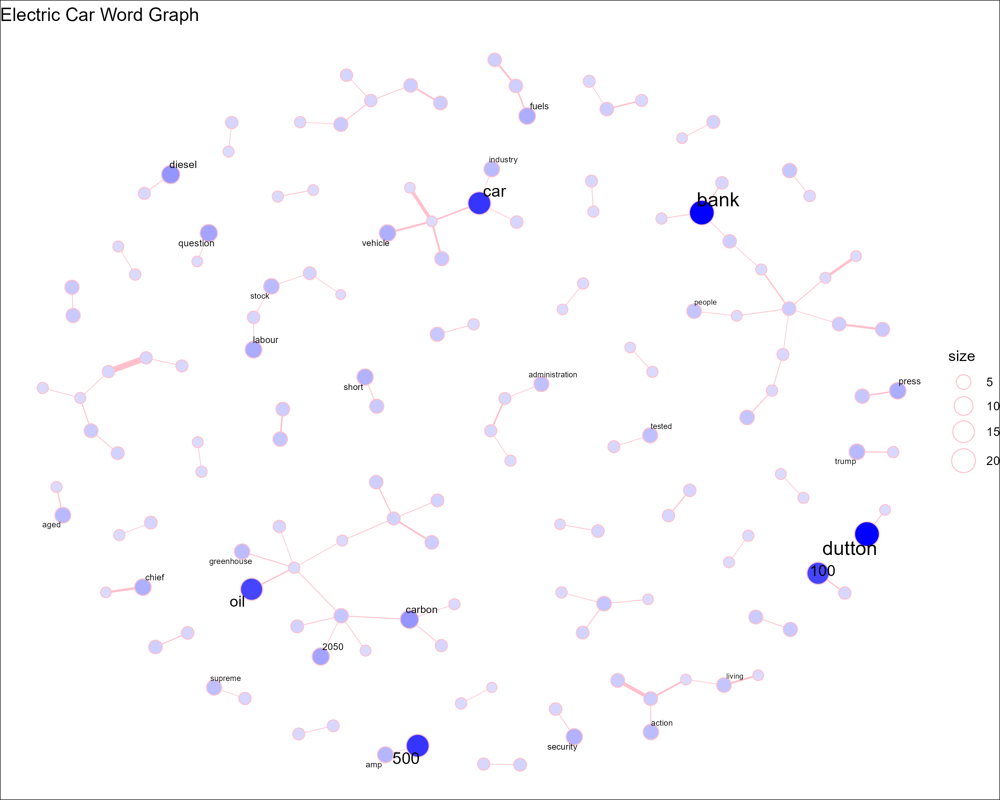
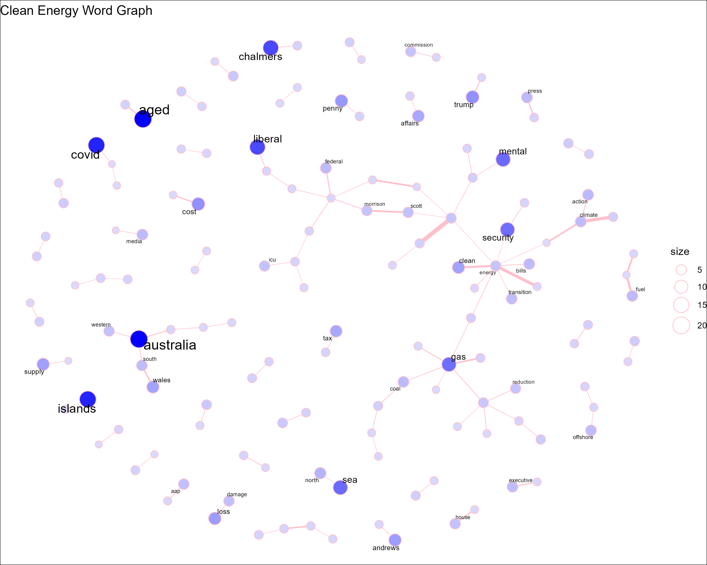

```{r setup, include=FALSE}
knitr::opts_chunk$set(echo = FALSE, warning = FALSE, message = FALSE)
```

## Introduction

In this class excercise (CE2) we are asked to use real-life scraping scenarios using the 'The Guardian' API which gives us access to over 2 million articles.

## Research Question

Based on the dataset, we want to answer the following research question:

**Can a keyword relationship be found between between articles which mention "clean energy" and "electric cars" ?**

## Hypothesis

Driven by climate change, renewable energy is a topic that is becoming more and more important in our society. We assume that the car industry also addresses the issue of renewable energies, as it undoubtedly has an influence on its production as well as on the marketing of electric cars.

We therefore hypothesize that:
- There is a high overlap of keywords between the articles which mention "clean energy" and "electric cars". 

##Methods

<!-- The topic of renewable energies is receiving more and more attention in the press. As well is private transport  as it plays a major role in climate change. Accordingly, the Guardian API comes in handy to scrape the articles related to the above mentioned topics. The data gained from the scrape will afterwards be evaluated fist by individual keyword searches and then with a keyword network analysis. -->

We use the pre-made wrapper function 'gu_content' from the 'guardianapi' package to scrape articles. We tried to write a custom-made wrapper function. However, the result of the queries were non-satisfying, as we ended always ended up with the same articles, independent of the date inputs.   

We evaluate the scraped articles using individual keyword searches and then with a keyword network analysis.

## Results

In a first step, we searched the articles in both subject areas for the most frequently used pair combinations. This gives us a first overview of whether similar keywords were used when editing the articles.
As can be seen in the results below, the combination "prime minister" was used most frequently in both topics. While the combination "clean energy" is in second place for the articles on the topic "clean energy", it is not in our list of most used combinations for the main topic "electric car". Nevertheless, at first glance one can see that there are frequently used combinations in both topics, such as: "climate change", "fossil fuels", "renewable energies" or "climate crisis".



In a second step, we would like to find out how the articles on the same topic are connected. To find out, we created word networks.  On the topic of "electric car", we were able to highlight a scattered network. The same is the case for the topic "renewable energies", but here with individual smaller networks within visible. 

```{r, fig.show='hold',out.width='50%', fig.cap='Word Treegraph of Each Topic'}




```

\newpage

### Sentiment Analysis

To identify the sentiment of the writers, we analysed the text with a sentiment analysis.


The Bing, Afinn and Syuzhet lexicons provide a polarity that sorts words into positive or negative positions with numerical values. The Bing lexicon has a binary categorisation that simply has two values of -1 and 1. The Afinn lexicon rates words between -5 and 5. The Syuzhet lexicon has more specific values for each mood word, ranging from -1 to 1. We scaled every result so that the range is between -1 and +1.

We have dispensed with an NRC or Vader Sentiment analysis as these take too long.

As can be seen from the three analyses, sentiment remains fairly neutral over time for both issues. Only in the Syuzhet analysis can more drastic changes be shown for both topics. From mid-2022 onwards, a drop in sentiment can be seen for articles on the topic of "electric cars" and an increase in sentiment for "renevable/clean energy".  


<!-- 

 -->
