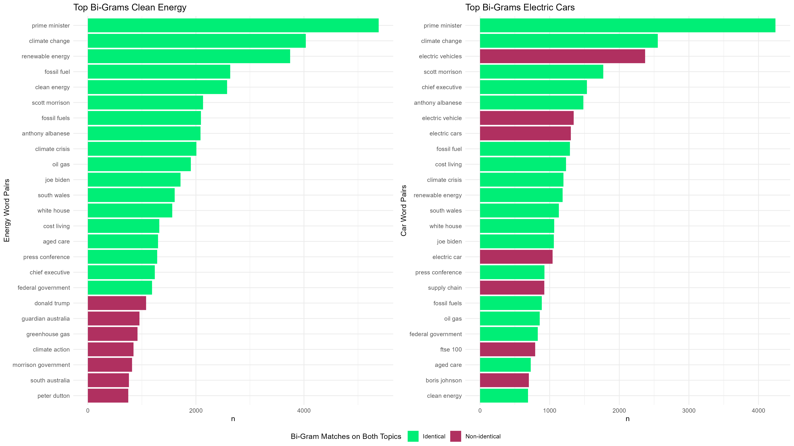

```{r setup, include=FALSE}
knitr::opts_chunk$set(echo = FALSE, warning = FALSE, message = FALSE)
```

## Introduction

In this class excercise (CE2) we are asked to use real-life scraping scenarios using the 'The Guardian' API which gives us access to over 2 million articles.

## Research Question

Based on the dataset, we want to answer the following research question:

**Can a keyword relationship be found between between articles which mention "clean energy" and "electric cars" ?**

## Hypothesis

Driven by climate change, renewable energy is a topic that is becoming more and more important in our society. We assume that the car industry also addresses the issue of renewable energies, as it undoubtedly has an influence on its production as well as on the marketing of cars.

We therefore hypothesize that:
- There is a high overlap of keywords between the articles which mention "clean energy" and "electric cars". 

##Methods

<!-- The topic of renewable energies is receiving more and more attention in the press. As well is private transport  as it plays a major role in climate change. Accordingly, the Guardian API comes in handy to scrape the articles related to the above mentioned topics. The data gained from the scrape will afterwards be evaluated fist by individual keyword searches and then with a keyword network analysis. -->

We use the pre-made wrapper function 'gu_content' from the 'guardianapi' package to scrape articles. We tried to write a custom-made wrapper function. However, the result of the queries were nonsatisfying, as we ended alway ended up with the same articles, independent of the date inputs.   

We evaluate the scraped articles using individual keyword searches and then with a keyword network analysis.

## Results




```{r, fig.show='hold',out.width='50%', fig.cap='Word Treegraph of Each Topic'}

knitr::include_graphics("../output/plots/word_tree_ggraph_car.png")
knitr::include_graphics("../output/plots/word_tree_ggraph_energy.png")

```

\newpage

### Sentiment Analysis


Please describe the Plot


<!-- 

 -->
