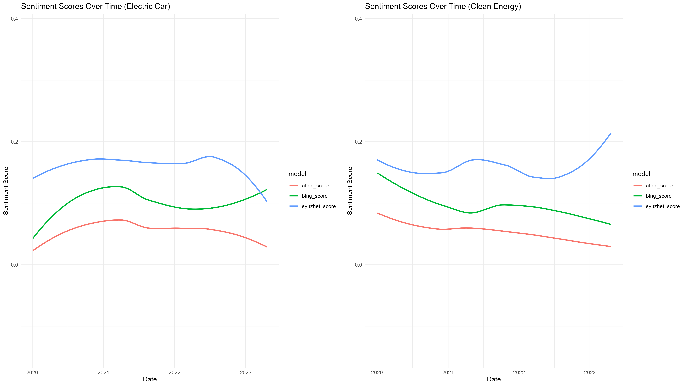

```{r setup, include=FALSE}
knitr::opts_chunk$set(echo = FALSE, warning = FALSE, message = FALSE)
```

## Introduction

In this class excercise (CE2) we are asked to use life-scrapping scenarios using The Guardian's API which gives us access to over 2 Million Articles.

## Research Question

Based on the dataset, we want to answer the following research question.

**Can a keyword relationship be found between between articles with "clean energy" and "cars" as main topic?**

## Hypothesis

As renewable energy is a topic that is becoming more and more important in our society, driven by climate change, we want to find out what impact it has on the car industry. We assume that the car industry will also address the issue of renewable energies, as it will undoubtedly have an influence on its production as well as on the marketing of cars.


## Results


```{r, fig.show='hold',out.width='50%', fig.cap='Word Treegraph of Each Topic'}

knitr::include_graphics("../output/plots/word_tree_ggraph_car.png")
knitr::include_graphics("../output/plots/word_tree_ggraph_energy.png")

```

\newpage

### Sentiment Analysis



Please describe the Plot


<!-- 

 -->
